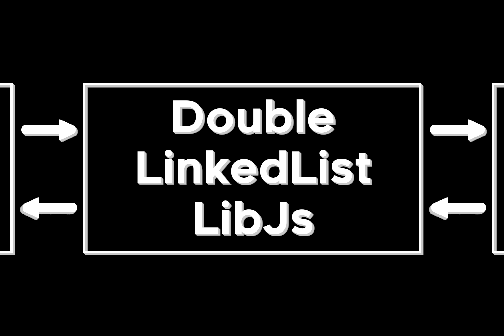

# DoubleLinkedListLibJs
A simple double linked list that stores the head, tail and length of the list.

This library was created, not only for education purposes, but to be a fast, effiecient and easy to use one way linked list library, which are perfect for things like ECS.

An example of the library's use can be seen here in the form of a snake game: https://github.com/RandomGamingDev/Snakep5js/tree/main

To use it you can simply include https://cdn.jsdelivr.net/gh/RandomGamingDev/DoubleLinkedListLibJs/list.js in your HTML file! If you want to you can also just download the file and include it in your HTML file that way.

btw stuff updates so remember to specify a version/commit for your library if you want to use a link and don't want your code to automatically update to the newest version of the library
